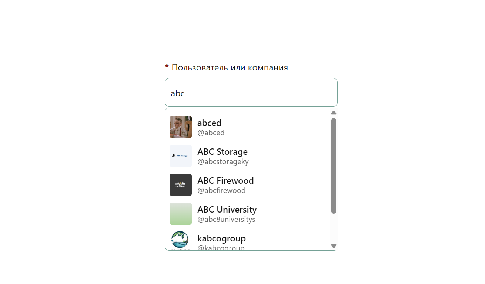

# Компонент с автоподсказкой на Vue + TypeScript



## Описание

Поисковый компонент с автоподсказкой и выпадающим списком, реализованный на Vue 3 с использованием Composition API и TypeScript. Поддерживает:

- Отложенные запросы (debounce)
- Индикацию загрузки и ошибок
- Управление фокусом и клавиатурную навигацию
- Отмену запросов (AbortController)
- ARIA-атрибуты и доступность

Проект построен с использованием:

- [Vue 3](https://vuejs.org/)
- [Vite](https://vitejs.dev/)
- TypeScript
- Composition API
- Кастомные хуки (`useApi`)

## Установка


### Клонировать репозиторий
```
git clone https://github.com/talfril/vue-suggest-dropdown.git
```

### Установить зависимости
```
npm install
```

### Запустить dev-сервер
```
npm run start
```
Приложение будет доступно по адресу: http://localhost:5173/

## Демонстрационная версия
Посмотреть работающую версию можно [здесь](https://test-task-kleek.vercel.app/)